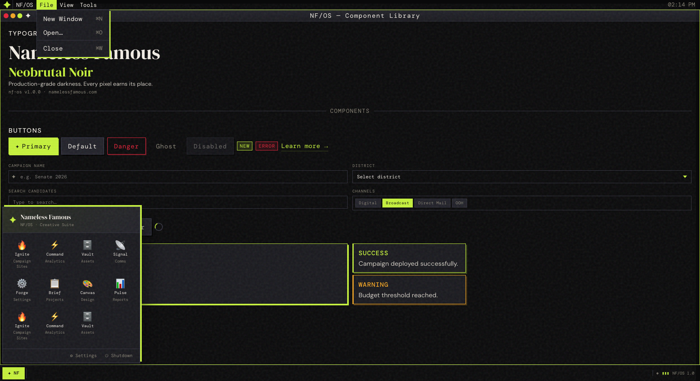

# @namelessfamous/brutnoir-os

Neobrutal Noir React design system inspired by vintage desktop UX (Mac OS + Windows 95) with modern dark aesthetics.



**(DEMO)[https://www.namelessfamous.com/projects/brutnoir-os/demo]**

- Draggable/resizable windows
- Desktop shell with menu bar + dock/start menu
- Forms, overlays, typography, and primitives
- Built-in design tokens + global style injector

## Installation

```bash
npm install @namelessfamous/brutnoir-os react react-dom
```

> This package is published to GitHub Packages. Make sure your project can install from `https://npm.pkg.github.com`.

## Quick Start

```tsx
import { useState } from "react";
import {
	Screen,
	Window,
	Header,
	Text,
	Button,
	Modal,
	Input,
} from "@namelessfamous/brutnoir-os";

export default function App() {
	const [open, setOpen] = useState(false);

	return (
		<Screen>
			<Window
				id="welcome"
				title="NF/OS — Welcome"
				icon="✦"
				defaultX={64}
				defaultY={40}
				defaultWidth={560}
				defaultHeight={380}
			>
				<div style={{ padding: 20, display: "grid", gap: 12 }}>
					<Header level={2} accent>
						Neobrutal Noir
					</Header>
					<Text muted>Production-grade darkness. Every pixel earns its place.</Text>
					<Button variant="primary" onClick={() => setOpen(true)}>
						Open Modal
					</Button>
				</div>
			</Window>

			<Modal
				open={open}
				onClose={() => setOpen(false)}
				title="Create Project"
				footer={<Button onClick={() => setOpen(false)}>Close</Button>}
			>
				<Input label="Project Name" placeholder="e.g. Ignite 2026" />
			</Modal>
		</Screen>
	);
}
```

## Core Concepts

- `Screen` is the root shell (full viewport). It sets up:
	- context/state provider
	- menu bar
	- dock/start menu
	- global styles + animation keyframes
	- managed window rendering + notification stack
- `Window` can be declared directly in JSX, or opened programmatically via `useScreen().openWindow(...)`.
- `useScreen()` gives OS-level controls for windows and notifications.

## Exports

### Layout

- `Screen`
- `Window`
- `MenuBar` (+ `MenuBarItem` type)
- `ScreenDock` (+ `DockApp` type)

### Core UI

- Typography: `Header`, `Text`, `Icon`
- Primitives: `Button`, `ButtonLink`, `Badge`, `Spinner`, `Card`, `Divider`

### Menus

- `MenuDropdown`, `MenuItem`, `MenuDivider`

### Forms

- `Input`
- `Select`
- `MultiSelect`
- `Typeahead`
- `SelectOption` type

### Overlays

- `Modal`
- `Notification`
- `Popover`
- `NotificationVariant` type

### Hooks / State

- `ScreenProvider`
- `useScreen`
- `ScreenContextValue`, `WindowConfig`, `WindowState`, `NotificationConfig`, `NotificationState` types

### Tokens & Styles

- `colors`, `fonts`, `radii`, `shadows`, `tokens`
- `ColorKey`, `FontKey` types
- `GlobalStyles`

## Programmatic Window Control

```tsx
import { useScreen, Button } from "@namelessfamous/brutnoir-os";

function LaunchIgnite() {
	const { openWindow, notify } = useScreen();

	return (
		<Button
			variant="primary"
			onClick={() => {
				openWindow({
					id: "ignite",
					title: "Ignite",
					icon: "🔥",
					defaultWidth: 720,
					defaultHeight: 480,
					content: <div style={{ padding: 20 }}>Campaign builder</div>,
				});
				notify({ title: "Success", message: "Ignite launched", variant: "success" });
			}}
		>
			Launch
		</Button>
	);
}
```

## Styling Notes

- Components are style-prop friendly and use inline styles internally.
- Most components expose `style` and/or `className` for local customization.
- `GlobalStyles` includes:
	- Google font imports (`DM Sans`, `DM Mono`, `DM Serif Display`)
	- reset/base styles
	- keyframe animations used by components

## TypeScript

The package ships with type declarations and supports strict TypeScript projects.

## Development

```bash
npm install
npm run build
npm run dev
npm run typecheck
```

## License

MIT

